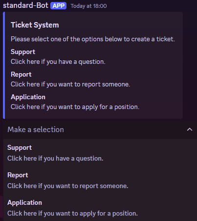
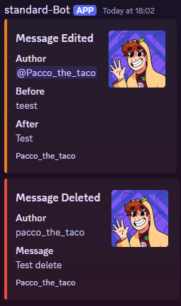
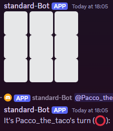

English version below

Deutsch:

Beispiele was der Bot kann: 

Der Bot hat ein eigenes Ticket System 

Der Bot schreibt automatisch in den Channel #log die gelogten Sachen wie z.B. Nachrichten löschen oder editieren 

Ihr könnt auch Tic Tac Toe spielen 

Installation für Programmierer: 
Um diesen Bot selber laufen lassen zu können muss man folgende Schritte machen:
- installiere die bibliothek discord.py mit "pip install -U discord.py"
- im Discord developer Portal (https://discord.com/developers/applications) eine neue Application erstellen
--> https://screens.paccothetaco.com/ScreensX/2024/08/18/Southernhairnosedwombat_rVDbu8adVo.jpg
- falls noch nicht vorhanden, muss dotenv installiert werden (pip install python-dotenv)
- im Code, im gleichen Pfad wo auch bot.py liegt die Datei .env erstellen
- im Discord Developer Portal unter dem Punkt Settings --> Bot, ist ein Button mit "Reset Token", wenn dieser gedrückt bekommt man einen Token und darunter erscheint der Button "Copy", einfach klicken und dann hat man den Token in der zwischenablage
- In der .env Datei muss jetzt einfach "DISCORD_TOKEN=(hier token vom Developer Portal einfügen)
- Auf https://github.com/settings/tokens einen neuen Token generieren und diesen auch in die .env Datei einfügen mit "GITHUB_TOKEN=(hier der Token von Github)" 
- Um den Bot nun zu starten einfach in das Verzeichnis navigieren wo die Datei bot.py liegt und dann python bot.py ausführen

Installation für nur normale Benutzer:
Installiere den Bot über den Link: https://discord.com/oauth2/authorize?client_id=1279462638841102357

---------------------------

English version:

Examples of what the bot can do: 

The bot has its own 

The bot automatically writes the logged things such as  to the #log channel.

You can also play 

Installation for programmers: 
To run this bot yourself you have to do the following steps:
- install the discord.py library with ‘pip install -U discord.py’
- create a new application in the Discord developer portal (https://discord.com/developers/applications)
--> https://screens.paccothetaco.com/ScreensX/2024/08/18/Southernhairnosedwombat_rVDbu8adVo.jpg
- if not already available, dotenv must be installed (pip install python-dotenv)
- in the code, in the same path where bot.py is located, create the file .env
- in the Discord Developer Portal under the item Settings --> Bot, there is a button with ‘Reset Token’, if you press it you get a token and below it the button ‘Copy’ appears, just click and then you have the token in the clipboard
- In the .env file, simply enter ‘DISCORD_TOKEN=(insert token from Developer Portal here)
- Generate a new token at https://github.com/settings/tokens and insert it into the .env file with ‘GITHUB_TOKEN=(here the token from Github)’ 
- To start the bot, simply navigate to the directory where the bot.py file is located and then execute python bot.py

Installation for normal users only:
Install the bot via the link: https://discord.com/oauth2/authorize?client_id=1279462638841102357